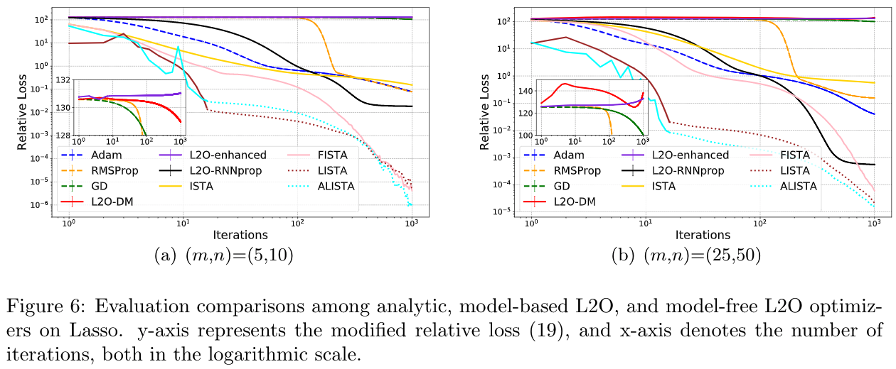
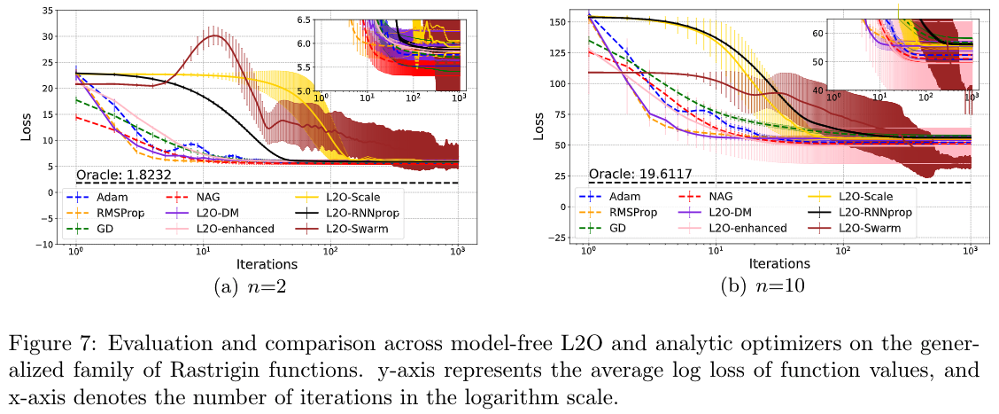

# Open-L2O

This repository is to offer a TF implemented toolbox v1 for learning to optimize.

[](https://opensource.org/licenses/MIT)

## Overview
Learning to optimize (L2O) aims to replace manually designed analytic optimization algorithms with learned update rules, as functions that can be fit from data. Classic optimization methods are engineered from basic methods in a theoretically justified manner, yet their solutions are often expensive to compute or mathematically not well defined. In comparison, L2O gains experience from training with similar optimization tasks in a principled and optimized way. This makes L2O particularly suitable for solving a certain type of optimization over a specific distribution of data repeatedly. L2O is gaining increased attention since, in comparison to classic methods, it is shown to find higher-quality solutions and/or with much faster convergence speed for many problems. However, there are significant theoretical and practicality gaps between manually designed optimizers and existing L2O models. 


Here we establish the first comprehensive benchmark efforts of existing L2O approaches on a number of problems and settings. We release our software implementation and data as the Open-L2O package, for reproducible research and fair benchmarking in the L2O field.


## Main Results
### Learning to optimize sparse recovery


### Learning to optimize Lasso functions



### Learning to optimize non-convex Rastrigin functions



### Learning to optimize neural networks


## Supported Model-base Learnable Optimizers


## Supported Model-free Learnable Optimizers

1. L2O-DM from *Learning to learn by gradient descent by gradient descent* [[Paper](https://arxiv.org/pdf/1606.04474.pdf)] [[Code](https://github.com/Tianlong-Chen/Awesome-L2O/blob/main/Model_Free_L2O/L2O-DM%20and%20L2O-RNNProp/README.md)]
2. L2O-RNNProp *Learning Gradient Descent: Better Generalization and Longer Horizons* from [[Paper](https://arxiv.org/pdf/1703.03633.pdf)] [[Code](https://github.com/Tianlong-Chen/Awesome-L2O/blob/main/Model_Free_L2O/L2O-DM%20and%20L2O-RNNProp/README.md)]
3. L2O-Scale from *Learned Optimizers that Scale and Generalize* [[Paper](https://arxiv.org/pdf/1703.04813.pdf)] [[Code](https://github.com/Tianlong-Chen/Awesome-L2O/blob/main/Model_Free_L2O/L2O-Scale%20/README.md)]
4. L2O-enhanced from *Training Stronger Baselines for Learning to Optimize* [[Paper](https://arxiv.org/pdf/2010.09089.pdf)] [[Code](https://github.com/Tianlong-Chen/Awesome-L2O/blob/main/Model_Free_L2O/L2O-DM%20and%20L2O-RNNProp/README.md)]
5. L2O-Swarm from *Learning to Optimize in Swarms* [[Paper](https://papers.nips.cc/paper/2019/file/ec04e8ebba7e132043e5b4832e54f070-Paper.pdf)] [[Code](https://github.com/Tianlong-Chen/Awesome-L2O/blob/main/Model_Free_L2O/L2O-Swarm/README.md)]
6. L2O-Jacobian from *HALO: Hardware-Aware Learning to Optimize* [[Paper](http://www.ecva.net/papers/eccv_2020/papers_ECCV/papers/123540477.pdf)] [[Code](https://github.com/Tianlong-Chen/Awesome-L2O/blob/main/Model_Free_L2O/L2O-Jacobian/README.md)]
7. L2O-Minmax from *Learning A Minimax Optimizer: A Pilot Study* [[Paper](https://openreview.net/forum?id=nkIDwI6oO4_)] [[Code]()]


## Supported Optimizees

Conv Functions:

- [x] Quadratic
- [x]  Lasso

Non-convex Functions:

- [x] Rastrigin

Minmax Functions:

- [x] Saddle
- [x] Rotated Saddle
- [x] Seesaw
- [x] Matrix Game

Neural Networks:

- [x] MLPs on MNIST
- [x] ConvNets on MNIST and CIFAR-10
- [x] LeNet
- [x] NAS searched archtectures


## Other Resources

- This is a Pytorch implementation of L2O-DM. [[Code](https://github.com/chenwydj/learning-to-learn-by-gradient-descent-by-gradient-descent)]
- This is the original L2O-Swarm repository. [[Code](https://github.com/Shen-Lab/LOIS)]
- This is the original L2O-Jacobian repository. [[Code](https://github.com/RICE-EIC/HALO)]


## Future Works

- [ ] TF2.0 Implementated toolbox v2 with a unified framework and lib dependency.


## Cite

```
TBD
```

